# Laporan Proyek Machine Learning
### Nama : Nisa Apriliana
### Nim : 211351102
### Kelas : Pagi A
 
## Domain Proyek
Susu merupakan salah satu bahan pangan yang paling banyak dikonsumsi oleh masyarakat di seluruh dunia. Susu yang berkualitas baik memiliki kandungan nutrisi yang tinggi dan aman untuk dikonsumsi. Oleh karena itu, penting untuk memastikan kualitas susu sebelum dikonsumsi.
Penilaian kualitas susu dapat dilakukan secara manual dengan menggunakan panca indera. Namun, penilaian manual ini memiliki keterbatasan, yaitu membutuhkan waktu yang lama dan rentan terhadap kesalahan penilaian.
## Business Understanding
Analisis ini digunakan untuk memprediksi kualitas susu dengan menggunakan beberapa faktor
### Problem Statements
Salah satu tantangan dalam menjaga kualitas susu adalah sulitnya untuk melakukan pemeriksaan secara manual. Pemeriksaan manual membutuhkan waktu dan tenaga yang cukup banyak, sehingga tidak efisien. Selain itu, pemeriksaan manual juga rentan terhadap kesalahan.
### Goals
Tujuan dari proyek ini untuk membantu produsen susu dalam menilai kualitas susu secara otomatis. Aplikasi ini diharapkan dapat meningkatkan efisiensi dan akurasi penilaian kualitas susu.
 
### Solution statements
 - Pengembangan Platform untuk memprediksi kualitas susu Berbasis Web
 - Menggunakan Algoritma KNN untuk memprediksi kualitas susu berdasarkan data seperti tekanan ph,suhu,bau,rasa,lemak,kekeruhan dan warna
    Manfaat :
    - Algoritma KNN adalah algoritma klasifikasi yang sederhana dan mudah diimplementasikan.
    - Algoritma KNN dapat bekerja dengan baik pada data yang tidak terdistribusi normal.
    - Algoritma KNN dapat digunakan untuk memprediksi kualitas susu.
## Data Understanding
Dalam proyek ini dataset yang digunakan berasal dari kaggle yang berisi data kualitas susu .Data set ini mengandung 8 kolom 
[Milk Quality Prediction](https://www.kaggle.com/datasets/cpluzshrijayan/milkquality)

### Variabel-variabel pada Milk Quality Prediction adalah sebagai berikut:
| No | Nama Variable    | Type Data |                                  Keterangan                               |
|----|------------------|-----------|---------------------------------------------------------------------------|
| 1  | PH               | float64   | Mendefinisikan PH alus susu yang berkisar antara 3 hingga 9,5 maks.       |
| 2  | Temprature       | int64     | Mendefinisikan Suhu susu yang berkisar antara 34'C hingga 90'C maks.      |
| 3  | Taste            | int64     | Mendefinisikan Rasa susu yang merupakan data kategori 0 (Buruk) atau 1 (Baik).              |
| 4  | Odor             | int64     | Mendefinisikan Bau susu yang merupakan data kategori 0 (Buruk) atau 1 (Baik).|
| 5  | Fat              | int64     | Mendefinisikan Bau susu yang merupakan data kategori 0 (Rendah) atau 1 (Tinggi).|
| 6  | Turbidity        | int64     | Mendefinisikan Kekeruhan susu yang merupakan data kategori 0 (Rendah) atau 1 (Tinggi).|
| 7  | Colour           | int64     | Mendefinisikan Warna susu yang berkisar antara 240 hingga 255.|
| 8  | Grade            | object    | Merupakan tipe tempat tinggal pasien ("Rural" or "Urban")|


## Data Preparation
Pada Tahap ini kita lakukan EDA

- Import Dataset
    karena kita menggunakan google colab maka langkah pertama kita hubungkan google colab dengan kaggle 
    ```bash
    from google.colab import files
    files.upload()
    ```
    kemudian membuat direktori dan berikan permission 
    ```bash
    !mkdir -p ~/.kaggle
    !cp kaggle.json ~/.kaggle/
    !chmod 600 ~/.kaggle/kaggle.json
    !ls ~/.kaggle
    ```
    kemudian kita panggil url dataset yang ada di website kaggle untuk 
    didownload langsung ke google colab.
    ```bash
    !kaggle datasets download -d cpluzshrijayan/milkquality
    ```
    kita ekstrak dataset yang sudah didownload
    ```bash
    !mkdir milkquality.zip
    !unzip milkquality.zip -d milkquality
    !ls milkquality
    ```
- <b>Import library yang dibutuhkan</b>
    oke lanjut kita deklarasi library yang akan digunakan pada kasus ini
    ```bash
    import pandas as pd
    import numpy as np
    import seaborn as sns
    import statistics
    import matplotlib.pyplot as plt
    from sklearn.model_selection import train_test_split
    from sklearn.neighbors import KNeighborsClassifier
    from sklearn.metrics import accuracy_score, confusion_matrix
    ```
    Pangggil dataset 
    ```bash
    df = pd.read_csv('milkquality/milknew.csv')
    ```
- <b>Data Discovery</b>
    Menampilkan 5 data teratas dari dataset
    ```bash
    df.head()
    ```
    Lalu kita cek tipe data dari masing-masing atribut/fitur dari dataset milknew.csv
    ```bash
    df.info()
    ```
    coba kita cek nilai yang kosong dalam pada dataset ini
    ```bash
    df.isnull().sum()
    ```
    oke tidak ada yang kosong
    Selanjutnya kita lakukan pembersihan spasi kosong yang mungkin ada di bagian awal atau akhir nama kolom dalam Data
    ```bash
    df.columns = df.columns.str.strip()
    ```
- <b> EDA</b>
    Kita gambarkan visualisasi dengan pie plot untuk melihat distribusi pada Grade.
    ```bash
    plt.figure(figsize=(5, 5))
    plt.pie(df["Grade"].value_counts(),
        labels=['Low(0)','Medium(1)','High(2)'],
        autopct='%.2f%%',
        startangle=90,
        colors=['aquamarine','coral','gold'],
        shadow=True)
    plt.title('Distribution of Grade')
    plt.show()
    ```
    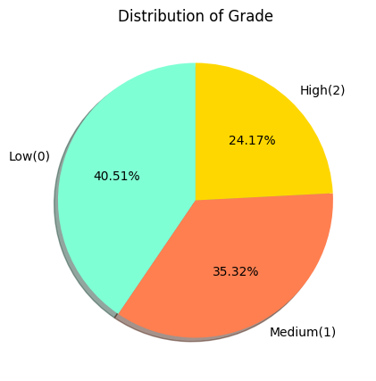
    Pada gambar diatas menunjukan bahwa jumlah kualitas susu yaitu kualitas susu bagus(high) 24,17% ,sedang(medium), dan buruk(Low)<br>
    
    Selanjutnya kita tampilkan jumlah frekuensi nilai pH 
    ```bash
    plt.figure(figsize=(8,5))
    plt.title("pH of Milk",fontsize=15)
    c1=sns.countplot(x='pH',data=df,palette="mako")
    plt.xticks(rotation=45)
    plt.show()
    ```
    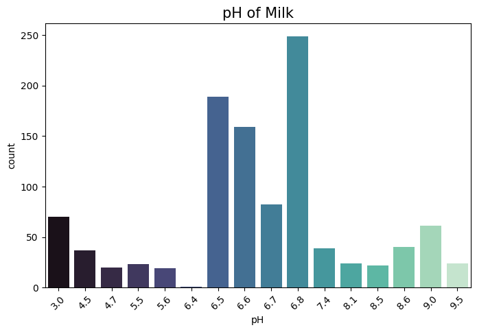
    kita gambarkan visualisasi untuk melihat jumlah frekuensi nilai Temprature
    ```bash
    plt.figure(figsize=(8,5))
    plt.title("Temperatur of Milk",fontsize=15)
    c1=sns.countplot(x='Temprature',data=df,palette="mako")
    plt.xticks(rotation=45)
    plt.show()
    ```
    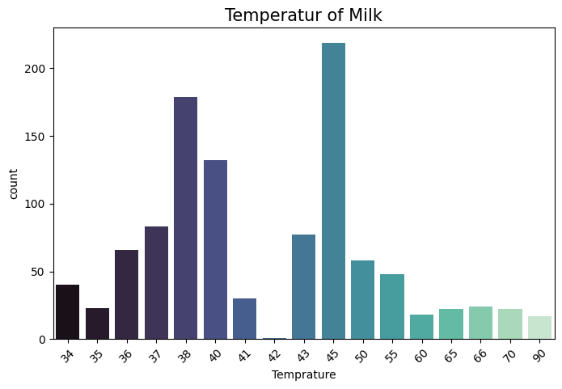
    kita tampilkan jumlah frekuensi nilai colour
    ```bash
    plt.figure(figsize=(8,5))
    plt.title("Colour of Milk",fontsize=15)
    c1=sns.countplot(x='Colour',data=df,palette="mako")
    plt.xticks(rotation=45)
    plt.show()
    ```
    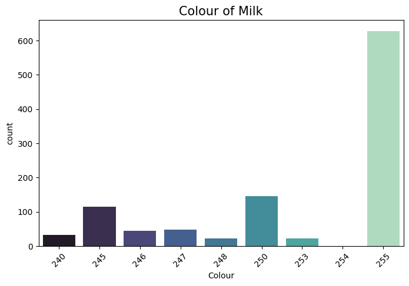
    kita tampilkan jumlah frekuensi nilai fat
    ```bash
    plt.figure(figsize=(8,5))
    plt.title("Fat of Milk",fontsize=15)
    c1=sns.countplot(x='Fat',data=df,palette="mako")
    plt.xticks(rotation=45)
    plt.show()
    ```
    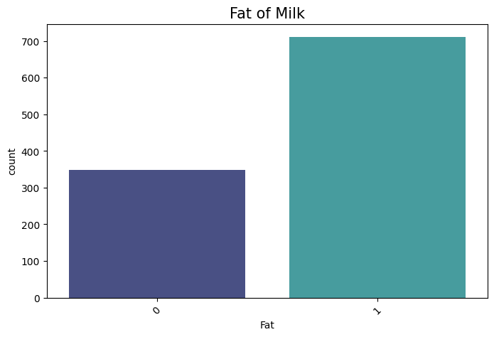

    Kita gambarkan visualisasi heatmap untuk melihat korelasi antar variabel.
    ```bash
    sns.heatmap(df.corr(), annot=True, cmap='coolwarm')
    ```
     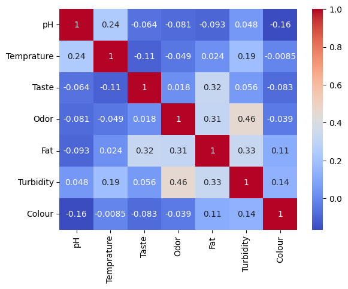

- <b>Data preparation</b>
    merubah data pada kolom grade menjadi bentuk numerik 
    ```bash
    df['Grade']=df['Grade'].map({'low':0,'medium':1,'high':2})
    df.head().
    ```
    Kita lakukan seleksi fitur dengan memisahkan mana saja atribut yang akan dijadikan sebagai fitur dan atribut mana yang dijadikan label.
    ```bash
   
    ```
    Pada script tersebut kita gunakan resoloution, ppi, cpu core, cpu freq,internal mem,ram, RearCam, Front_Cam, battery dan thickness sebagai fitur yang nantinya akan kita jadikan inputan. Sedangkan price kita jadikan sebagai label karena price merupakan nilai yang akan diestimasi.

    lanjut kita ke tahap modeling
## Modeling

Tahap pertama kita lakukan split data, yaitu memisahkan data training dan data testing
```bash
X_train,X_test,y_train,y_test=train_test_split(X,y,test_size=0.3,random_state=42)
```
Inisialisasi model KNN dengan 2 tetangga terdekat
```bash
knn = KNeighborsClassifier(n_neighbors=2)
```
Melatih model KNN dengan data train.
```bash
knn.fit(X_train,y_train)
```
Melakukan prediksi menggunakan data testing dan menampilkan akurasi dari hasil prediksi
```bash
y_pred=knn.predict(X_test)
score = knn.score(X_test, y_test)
print('akurasi model knn = ', score)
```
wow akurasi modelnya 99.37%

Tahap berikutnya adalah kita coba model dengan inputan berikut.
```bash
input_data = np.array([[6.6,36,0,1,0,1,253]])
prediction = knn.predict(input_data)
print('Estimasi Kualitas Susu :', prediction)
```
Jika sudah berhasil jangan lupa untuk simpan model menggunakan pickle
```bash
import pickle
filename ='estimasi_milkquality.sav'
pickle.dump(knn,open(filename,'wb'))
```
kita tampilkan visualisasi hasil prediksi model knn
```bash

def knn_visualization(k, X_test, y_test, y_pred):
    plt.figure(figsize=(10, 8))

    correct_pred = (y_pred == y_test)
    wrong_pred = (y_pred != y_test)

    plt.scatter(X_test[y_test == 2]['pH'], X_test[y_test == 2]['Colour'], color='green', label='Grade = 2', alpha=0.7, s=50)
    plt.scatter(X_test[y_test == 1]['pH'], X_test[y_test == 1]['Colour'], color='red', label='Grade = 1', alpha=0.7, s=50)
    plt.scatter(X_test[y_test == 0]['pH'], X_test[y_test == 0]['Colour'], color='blue', label='Grade = 0', alpha=0.7, s=50)

    plt.xlabel('pH')
    plt.ylabel('Colour')
    plt.title(f'KNN Scatter Plot (K = {k})')
    plt.legend()

    plt.scatter(x=X_test.iloc[0]['pH'], y=X_test.iloc[0]['Colour'], color='black', s=300, marker='*')

    plt.show()

    k_value = 2
    knn_visualization(k_value, X_test, y_test, y_pred)

   ```
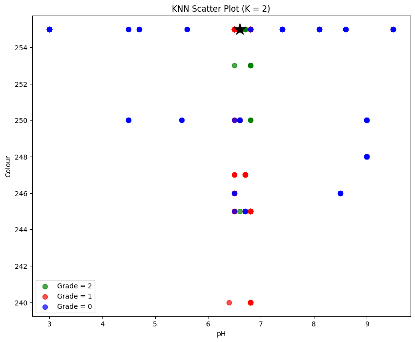

## Evaluation
Metrik evaluasi yang digunkan yaitu Akurasi dan Confusion Matrix.
- Akurasi
  Mengukur seberapa sering model melakukan prediksi yang benar secara keseluruhan dari semua kelas. Diukur dengan persentase prediksi yang benar dari total prediksi.
- Confusion Matrix
  Berupa tabel yang menunjukkan performa model pada klasifikasi, membandingkan nilai aktual dengan nilai yang diprediksi oleh model untuk setiap kelas. Terdiri dari empat bagian:
  - True Positive (TP): Prediksi yang benar untuk kelas positif.
  - True Negative (TN): Prediksi yang benar untuk kelas negatif.
  - False Positive (FP): Prediksi yang salah untuk kelas positif.
  - False Negative (FN): Prediksi yang salah untuk kelas negatif.


Berikut hasil visualisasi confusion matrix
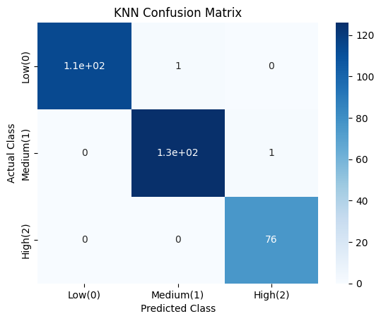
Dari gambar diatas dapet simpulkan bahwa model tampaknya memiliki kinerja yang baik, karena sebagian besar prediksi adalah benar (terlihat dari nilai di diagonal matriks)

## Deployment
[App Milk Quality Prediction](https://prediction-milk-4zynmn8fo6lvvuqjfxytwu.streamlit.app/)

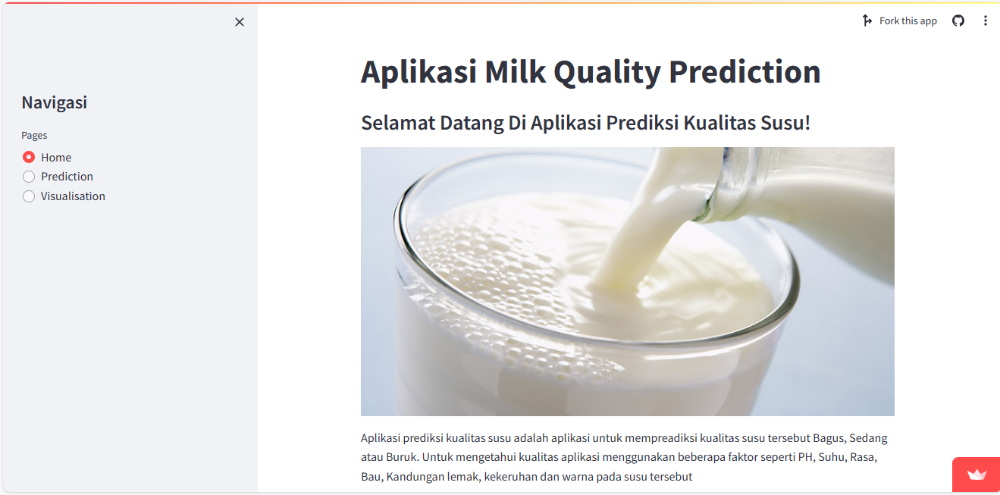
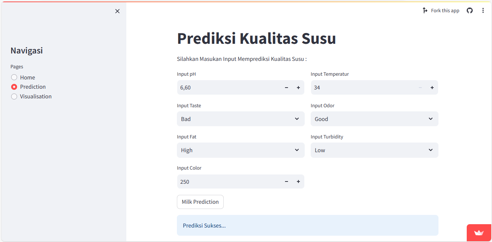
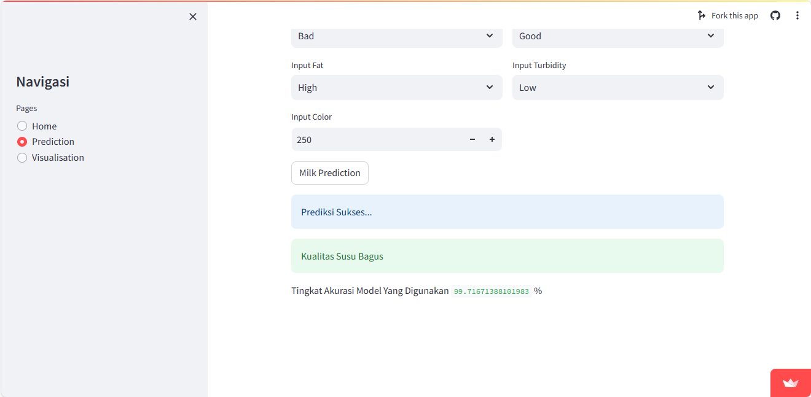
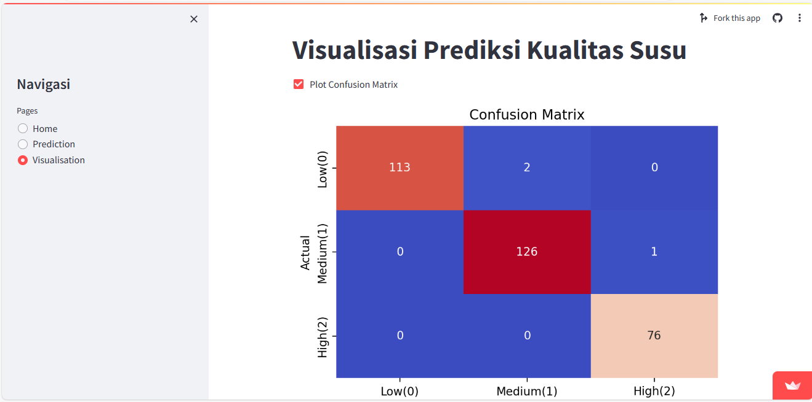
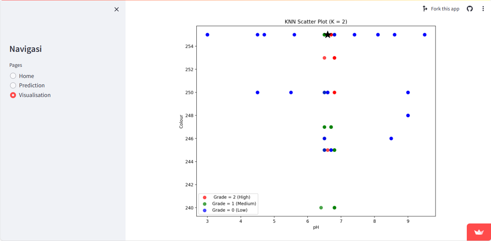